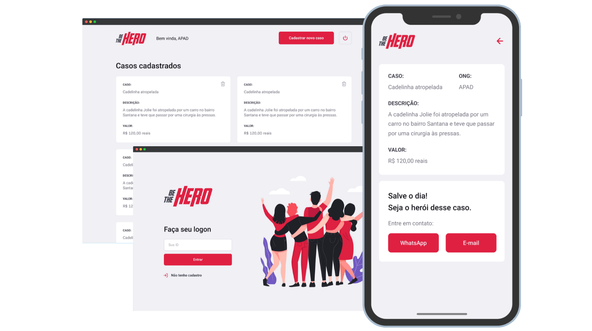

 This app is base on : https://github.com/fariasmateuss/BeTheHero/commits/master 

  

  

  
  
  

  

  

 

  App to help NGOs built with ReactJS, React Native, Laravel and more. 

  Landtrader is a project that aims to connect people who want to make monetary 
  contributions to NGOs (non-governmental organizations) that need help.

## Tech

- Laravel
- React
- React Native
- Expo
- MySQL
- Jest

## Development setup

### Api
- Run `composer install` in the `api` folder;
- Run `php artisan migrate` to migrate data;
- Run `php artisan passport:install` to install passport auth_client
- Run `php artisan serve --host {ip_address} --port {port}` to start server , which {ip_address} and {port} will use for axios connect to. 

### Front-End 
- Run `yarn` in the `frontend` folder;
- Run `yarn start` to up the project;

### Mobile 
- Run `yarn` in the `mobile` folder;
- Update the baseURL at src/services/api.js.
- Run `expo start` to up the project.

### Test
- Run `yarn test:backend` at the backend folder;
  
## Contribution

See the [contribution guide](CONTRIBUTING.md) for more details on how to contribute to this project.

# License
[MIT License](/LICENSE)
